# 📰 The NSS Chronicle | IIIT-NR Edition

> **"Not Me, But You"** - A digital embodiment of the NSS spirit, blending vintage aesthetics with modern web technologies and AI integration.

---

## 📖 Overview

**The NSS Chronicle** is a comprehensive web platform designed for the National Service Scheme unit of IIIT-Naya Raipur. It serves as both a public news portal and an administrative powerhouse. The site features a unique "digital newspaper" design, complete with paper textures, classic typography, and interactive elements.

Beyond its looks, it boasts a robust **Content Management System (CMS)** and **AI-powered features** that allow for dynamic storytelling and automated assistance.

---

## 🏗️ Architecture

The project follows a modern Client-Server architecture with AI service integration.

```mermaid
graph TD
    subgraph Client Side
        Visitor[👤 Visitor]
        Admin[🔑 Admin]
        UI[🖥️ Frontend UI]
        Config[⚙️ Config.js]
    end

    subgraph Server Side
        API[🚀 Express API]
        Auth[🛡️ Logic Layer]
        Uploads[📂 File Storage]
    end

    subgraph External Services
        DB[(🍃 MongoDB Atlas)]
        AI[🤖 Gemini AI]
        Weather[☁️ Open-Meteo API]
    end

    Visitor -->|Reads News| UI
    Admin -->|Uploads Content| UI
    UI -->|Reads API URL| Config
    UI -->|HTTP Requests| API
    API -->|CRUD Operations| DB
    API -->|Generate Content| AI
    API -->|Save Images| Uploads
    UI -->|Fetch Weather| Weather
```

---

## ✨ Key Features

### 🏛️ Public Portal
- **Vintage Newspaper UI**: Custom CSS styling with paper textures, drop caps, and classic fonts (Playfair Display, Cinzel).
- **Dynamic Content**: Real-time loading of news, events, and awards from the database.
- **Interactive Gallery**: A photo essay grid showcasing NSS activities.
- **Live Widgets**: Real-time Weather (Open-Meteo) and Date/Time displays.
- **AI Assistant**: A built-in chatbot to answer queries about NSS.

### 🛠️ Admin Dashboard
- **Secure CMS**: A dedicated `admin.html` portal for managing content.
- **Photo Management**: Upload, view, and delete photos with captions and categories.
- **Event Management**: Add upcoming events to the sidebar.
- **Award Recognition**: Update the "Hall of Fame" section.

### 🤖 AI Integration
- **Story Generator**: Generates full news stories from short photo captions using Gemini.
- **Chatbot**: Context-aware AI assistant for site visitors.

---

## 💻 Tech Stack

| Component | Technology | Description |
|---|---|---|
| Frontend | HTML, CSS, JS | Static site with interactive widgets |
| Backend | Node.js, Express | REST API for content and auth |
| Database | MongoDB Atlas | Stores articles, events, images |
| AI | Gemini | Story generation and assistant |
| Hosting | Any static host / Node server | Deployable to Netlify, Vercel, or custom VPS |

---

## 🚀 Getting Started

1. Clone the repo:

   git clone https://github.com/AdityaaTyagi56/Full-Stack_Website.git
   cd Full-Stack_Website

2. Install the server dependencies (if running backend):

   cd server
   npm install
   npm start

3. Serve the frontend from the `frontend` directory. For example:

   cd ../frontend
   npx http-server -p 8080

4. Configure `scripts/config.js` to point to your API endpoint if running locally.

---

## 🔒 Security & Privacy

- Do not commit production credentials. Use environment variables for DB URI and API keys.
- Ensure file uploads are validated and scanned before storage.

---

## 🤝 Contributing

Contributions are welcome! Please open an issue or submit a pull request.

---

## 📄 License

MIT License
